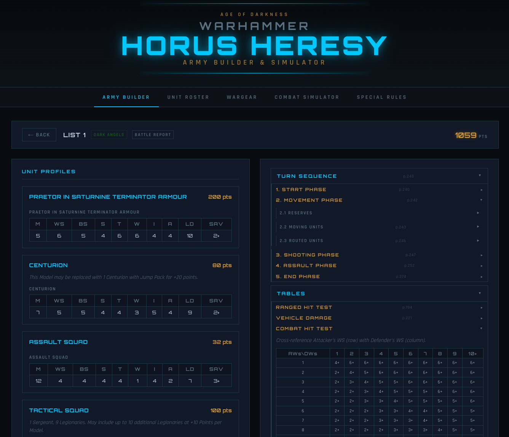

# Horus Heresy Army Builder & Simulator

**Build your legion. Crush the enemy. Know the odds before the dice hit the table.**

A fan-made army builder and combat simulator for Warhammer: The Horus Heresy (Age of Darkness). Craft army lists, browse unit profiles and wargear, simulate shooting and assault phases, and keep a battle report cheat sheet at your fingertips — all from your browser.



## Features

- **Army Builder** — assemble lists with units, detachments, and wargear with live point totals
- **Unit Roster** — browse unit profiles with full stat lines
- **Wargear Reference** — searchable weapons and equipment catalog
- **Combat Simulator** — run hit, wound, and save calculations to see expected outcomes
- **Special Rules** — quick-reference for army and unit special rules
- **Battle Report** — turn sequence cheat sheet with phase-by-phase reference tables

## Getting Started

### Prerequisites

- [Node.js](https://nodejs.org/) (v18+)

### Install & Run

```bash
# Clone the repo
git clone https://github.com/joshuabelden/horus-heresy.git
cd horus-heresy

# Install dependencies
npm install

# Start the dev server
npm run dev
```

The app will be running at **http://localhost:5173**.

### Build for Production

```bash
npm run build
npm run preview   # preview the production build locally
```

### Type Checking

```bash
npm run check
```

## Tech Stack

- [Svelte 5](https://svelte.dev/) + TypeScript
- [Vite](https://vitejs.dev/)

## License

This project is unofficial and fan-made. Warhammer: The Horus Heresy is a trademark of Games Workshop. This project is not affiliated with or endorsed by Games Workshop.
